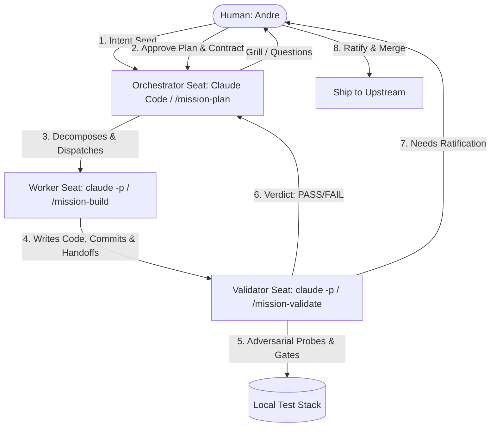

# Review: AI Coding Agent Software Factory Harnesses

This document details the architecture, configuration files, scripts, and runtime harnesses that form the **AmiticIA Software Factory (v2)**, as implemented and pilot-tested in the `wahub` repository.

---

## 1. Executive Summary & Purpose

The software factory is designed to solve a critical constraint in AI-driven development: **human attention, not model intelligence, is the bottleneck**. 

By decoupling **WHAT** (intent and verification) from **HOW** (implementation), the factory allows a single human operator (Andre) to drive multiple coding agents concurrently across different projects. It relies on a provider-agnostic, local-first runtime harness, allowing tasks to run unattended for hours or days with high predictability.

### The Core Objective (KPI)
* **attention-per-feature**: Measured as the sum of human touchpoints, orchestrator interventions, and worker escalations per shipped feature. The factory aims to ratchet this metric down over time.

---

## 2. Reference Architecture & Three-Seat Topology

To enforce strict adversarial pressure and prevent context rot, the factory splits responsibility across three specialized "seats":



### The Three Seats
1. **Orchestrator (Planning)**:
   * **Role**: Turn an intent seed into a structured brief, plan, validation contract, and scoped feature specs.
   * **Context**: Reads the PRD, glossary ([CONTEXT.md](file:///home/andre/Projects/amiticia/repositories/products/wahub/CONTEXT.md)), high-level standard rules ([AGENTS.md](file:///home/andre/Projects/amiticia/repositories/products/wahub/AGENTS.md)), and the existing code structure.
   * **Output**: `brief.md`, `plan.md`, `contract.md`, and scoped feature specs `features/NN.md`.
2. **Worker (Implementation)**:
   * **Role**: Implement exactly one feature spec in a completely clean, isolated environment using Test-Driven Development (TDD).
   * **Context**: Reads **ONLY** its assigned feature spec `features/NN.md` + [AGENTS.md](file:///home/andre/Projects/amiticia/repositories/products/wahub/AGENTS.md) + [constitution.md](file:///home/andre/Projects/amiticia/repositories/products/wahub/factory/constitution.md). It is blocked from reading the PRD, other features, or sibling tasks to prevent scope-creep.
   * **Output**: Code changes, a Git commit, and a structured `handoff.md`.
3. **Validator (Adversarial Verification)**:
   * **Role**: Act as a fresh, adversarial check. Prove the correctness of the code against the validation contract.
   * **Context**: Reads **ONLY** the contract and the git diff of the mission. It has no access to the worker's files, comments, or handoffs.
   * **Output**: PASS/FAIL verdict, recorded in code via `verdict.mjs`.

---

## 3. Workspace Isolation & Port/DB Allocation (`pnpm dispatch`)

To support parallel workers without port collisions or database state leakage, the factory relies on **dispatched Git worktrees**. 

Running `/mission-build <slug>` triggers the [dispatch-worktree.sh](file:///home/andre/Projects/amiticia/repositories/products/wahub/scripts/dispatch-worktree.sh) script, which executes the following automation:

1. **Worktree Creation**: Materializes a git worktree under `.claude/worktrees/<slug>/` on a checkout branch named `agent/<slug>`.
2. **Resource Allocation**:
   * Hashes the slug using SHA-1 to compute a decimal slot $S \in [0, 255]$.
   * Allocates a unique, non-colliding port block:
     * **Backend Port**: $3100 + S \times 4$
     * **Frontend Port**: $\text{Backend} + 1$
     * **MSW mock server Port**: $\text{Backend} + 2$
     * **Playwright HTML Report Port**: $\text{Backend} + 3$
   * Allocates a unique PostgreSQL database: `wahub_<slug>` (hyphens replaced by underscores).
3. **Environment Setup**:
   * Symlinks `.env`, `.env.test`, and `.env.smoke` from the parent repository.
   * Writes a localized `.agent-env` containing the port and `DATABASE_URL`/`DIRECT_URL` overrides.
4. **Agent Contract Stamping**:
   * Creates `.claude/AGENT.md` in the worktree based on [agent-prompt.md](file:///home/andre/Projects/amiticia/repositories/products/wahub/scripts/agent-prompt.md), explicitly enforcing containment rules (*"STAY HERE"*, *"Never bypass hooks"*, *"Source .agent-env"*).
   * Copies the Leader's plan to `.claude/PLAN.md` to act as the worker's strict boundaries.
5. **Database Provisioning**:
   * Automatically provisions the new database via `psql`.
   * Rebuilds shared libraries (`pnpm --filter @wahub/shared build`) and generates Prisma bindings.
   * Runs `prisma db push` to prepare the database schema on the isolated database.

---

## 4. The Stochastic-Deterministic Boundary (SDB) & Bounded Validate-to-Fix Loop

The factory leverages a **Stochastic-Deterministic Boundary (SDB)**. Prompts/models own the stochastic layer (planning, delegation, heuristics), while deterministic scripts enforce the boundaries (testing, linting, quality baselines, and retry loops).

### The Validate-to-Fix Loop (HG-6)
When a Validator detects a failure, it records a `FAIL` verdict. Rather than giving up or letting the agent loop infinitely, the orchestrator triggers a strictly bounded validate-to-fix cycle enforced in code:

```
[Validator Verdict] ── FAIL ──> [Orchestrator Spawns Scoped Fix Worker]
                                      │
                                      ▼
                                [Fix Worker patches code in same Worktree]
                                      │
                                      ▼
                                [Fresh Validator verifies Contract]
                                      │
                         ┌────────────┴────────────┐
                      PASS                      FAIL
                         │                         │
                  [Ratification]        [Is Round Count < 3?]
                                           ├── Yes ──> [Loop again]
                                           └── No  ──> [Escalate to Andre]
```

* **3-Round Max Bounding**: Bounded by [verdict.mjs](file:///home/andre/Projects/amiticia/repositories/products/wahub/scripts/factory/verdict.mjs). Round 4+ is blocked by the script, which exits with code `2` to force a human escalation.
* **Verdict Storage**: Every round is validated against a strict JSON schema and appended as a single JSONL line in `factory/missions/<slug>/validate.log`.
* **Adversarial Integrity**: The fix worker only sees the raw fail report and contract slice, not the validator's internal code or reasoning.

---

## 5. Deterministic Quality Gate & Drift Attribution (`quality-gate.mjs`)

The [quality-gate.mjs](file:///home/andre/Projects/amiticia/repositories/products/wahub/scripts/quality-gate.mjs) script serves as the deterministic gate. It measures the code against a baseline floor committed in `quality-baseline.json` and blocks regressions.

### Tracked Metrics
* **File Size**: Identifies files exceeding 500 lines of code.
* **Cognitive Complexity**: Parses Biome check diagnostics for `lint/complexity/noExcessiveCognitiveComplexity`.
* **Dead Code**: Runs `knip` to track unused exports, types, files, and dependencies.
* **Code Duplication**: Invokes `jscpd` to capture duplicate code blocks.
* **Type Safety & Type Suppression**: Inspects files using `grep` for `: any`, `as any`, `<any>`, `@ts-ignore`, and `@ts-expect-error`.
* **Test Verification**: Ensures test suites are not weakened by tracking test assertion counts (`it`, `test`, `expect`).
* **Test Coverage**: Measures V8 statement, branch, function, and line coverage percentages for both frontend and backend.

### Drift Attribution
A common issue in CI/CD is "baseline rot," where changes to `main` cause an agent's branch to fail quality checks due to inherited, pre-existing issues.

[quality-gate.mjs](file:///home/andre/Projects/amiticia/repositories/products/wahub/scripts/quality-gate.mjs) solves this through **automated drift attribution**:
1. When a static metric regresses, the script identifies the git merge-base between the agent's branch (`HEAD`) and the main branch (`origin/main` / `main`).
2. It spins up a temporary git worktree at that merge-base SHA.
3. It symlinks the current `node_modules` and re-runs the quality metric collectors against the historical merge-base tree.
4. **Attribution Logic**:
   * If the metric violation was **already present** at the merge-base, it is classified as `preExisting` drift. It issues a warning but **does not block the build**.
   * If the regression was **introduced by the worker**, it blocks the build.

---

## 6. Unified Spec Document Taxonomy

The factory operates on a small, highly structured taxonomy of markdown documents:

| Document | File Path | Purpose |
|---|---|---|
| **Constitution** | [constitution.md](file:///home/andre/Projects/amiticia/repositories/products/wahub/factory/constitution.md) | Standing rules that govern all three seats. Terse and rarely changed. |
| **Decisions Log** | [decisions.md](file:///home/andre/Projects/amiticia/repositories/products/wahub/factory/decisions.md) | Append-only architectural decisions (replacing heavy ADR folders). |
| **Mission Brief** | `factory/missions/<slug>/brief.md` | WHAT and WHY. Authored by the human owner. Contains product requirements and outcomes. |
| **Plan & Contract** | `factory/missions/<slug>/plan.md` & `contract.md` | The milestones, features, and bipartite test coverage map (every assertion mapped to a feature). Approved by the human gate. |
| **Feature Spec** | `factory/missions/<slug>/features/NN.md` | Scoped instructions for a single worker (files to touch, subset of assertions, pre-assembled code context). |
| **Handoff** | `factory/missions/<slug>/features/NN.handoff.md` | Structured facts written by the worker (files changed, exit codes, issues hit, and unmet knowledge). |

---

## 7. Read-Only Kanban Board & Reporting Dashboards

The factory projects its state onto a terminal backlog and a local/remote HTML dashboard:

* **Board Backend (`backlog.md` integration)**: Invoked via `pnpm board`, it displays columns tracking Intake, Planning, Building, Validating, Needs Human, and Done.
* **Synchronizer ([board-sync.mjs](file:///home/andre/Projects/amiticia/repositories/products/wahub/scripts/factory/board-sync.mjs))**: Automatically updates cards based on file state (e.g., presence of `APPROVED`, validation logs, or `RATIFIED` markers).
* **HTML Report Generator ([board-report.mjs](file:///home/andre/Projects/amiticia/repositories/products/wahub/scripts/factory/board-report.mjs))**: Compiles the markdown states into a clean, portable HTML dashboard saved to `dist/factory-board/index.html`.
* **VPS Deployment ([board-publish.sh](file:///home/andre/Projects/amiticia/repositories/products/wahub/scripts/factory/board-publish.sh))**: Packages and syncs the dashboard using `rsync` to a secure basic-auth web service.

---

## 8. Telemetry & the Curated Knowledge Loop

To verify the viability of the software factory, telemetry is collected throughout each seat's lifetime using the [metrics.mjs](file:///home/andre/Projects/amiticia/repositories/products/wahub/scripts/factory/metrics.mjs) command harness.

### Telemetry Events
* **`touchpoint`**: Recorded every time a human operator is engaged (intake grill, plan approval, ratification).
* **`intervention`**: Recorded when the human operator has to intervene and debug a seat.
* **`escalation`**: Recorded when a worker fails or runs out of retries, escalating to the human.
* **`phase_start` / `phase_end`**: Wall-clock boundaries for planning, building, and validation.
* **`false_idle`**: Recorded when an idle alarm turns out to be a false positive.
* **`worker_death`**: Recorded if an agent process terminates unexpectedly.
* Logged entries include **tokens consumed** and **USD cost** (integrated with `opencode-worker.mjs` for external seats like GLM-5.2).

### The Curation Loop
Whenever a worker runs into missing information, it records it in `unmet_knowledge[]` inside its feature handoff file. These lines are mined by the orchestrator during planning phases and curated back into [AGENTS.md](file:///home/andre/Projects/amiticia/repositories/products/wahub/AGENTS.md) or standard documentation files, creating a demand-driven learning loop.
